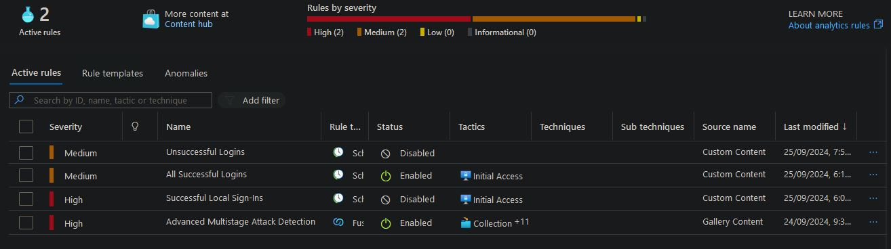
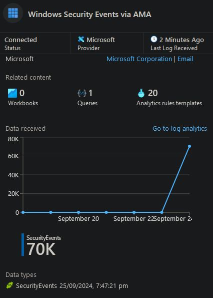
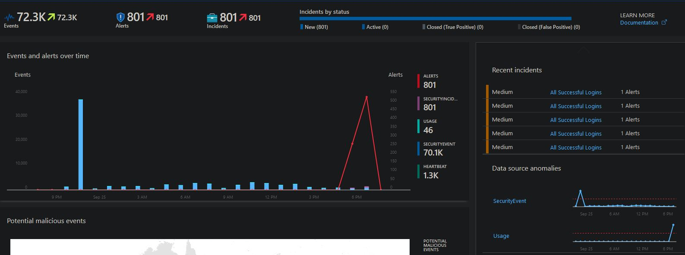
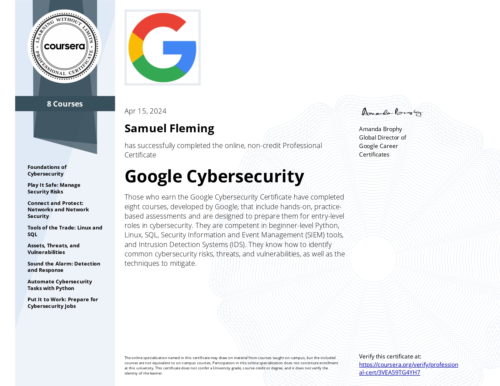

Hi there! 

Thank you for taking the time to look over my home projects. Here you will find a growing set of cybersecurity and networking ventures.

# Microsoft Sentinel Log Aggregation

Using Microsoft Azure, I ran a deliberately exposed Virtual Machine with RDP (port 3389) enabled. My aim was to detect remote login attempts and automate alerts through the Microsoft Sentinel SIEM tool. I set up the following log rules to automatically filter all events and set severity levels for each of them.

- Unsuccesful Logins (Medium)
- All Succssful Logins (Medium)

I was able to aggregate these remote login alerts from Azure Monitor Agent (transfering them to Sentinel) and tune alerts, displaying them in an easy to understand dashboard.
## AMA Logs 
* * *

## Sentinel Dashboard Representation
* * *

# Cisco Packet Tracer Lan Network
***

Using Cisco Packet Tracer, I created and configures a home LAN network comprised of routers, wireless routers, switches and user end-devices.

*

First I implemented a switch connected to two PC's connected by straight-through cables for one end of the network. On the opposite sidem I had a phone, tablet and laptop connected to a wireless router; which I then binded to a central router.

## Part 1

https://github.com/user-attachments/assets/8c374856-8cbc-4ecf-8aba-cad3d1c335e0

After physically connecting the device, I swapped out the Laptop's connector so that it could communicate wirelessly to the Home Wireless Router. I needed to assign static IPv4 addresses to each network device and some of the Ethernet ports so that they could be properly configured to communicate with each other. I set the 'switch' side of the network to a 192.168.1.0 network and the 'wireless' side to 192.168.0.0 to prevent any overlap.

## Part 2

https://github.com/user-attachments/assets/62eff54b-fa12-4a01-9e3a-6bb4f215303b

Following the above steps, I assigned the proper Default Gateway for deivces to forward their outbound packets to; as to not have packets be dropped or lost. The final step in ensuring successful communication across the network was telling the router where incoming traffic was to go. Without knowing where to send packets from the segmented networks, the router would simply drop the packets. As such, I entered static routes so that the router could properly handle the traffic. I was able to test the network by pinging the laptop on the 192.168.0.0 network from the 192.168.1.0 network.

## Part 3

https://github.com/user-attachments/assets/e5af41a8-f21a-4b15-ba4b-7a557679e84e

 
# Certifications
A list of my current cybersecurity certificates.
## CompTIA Security+
* * *
The new CompTIA Security+ (SY0-701) represents the latest and greatest in cybersecurity, covering the most in-demand skills related to current threats, automation, zero trust, IoT, risk – and more. Once certified, you’ll understand the core skills needed to succeed on the job – and employers will notice too. The Security+ exam verifies you have the knowledge and skills required to:

   Assess the security posture of an enterprise environment and recommend and implement appropriate security solutions.
   Monitor and secure hybrid environments, including cloud, mobile, Internet of Things (IoT), and operational technology.
   Operate with an awareness of applicable regulations and policies, including principles of governance, risk, and compliance.
   Identify, analyze, and respond to security events and incidents. 

## Google Cybersecurity
* * *
The Google Cybersecurity Certificate program provides the skills needed for a career in cybersecurity. Using industry standard tools like Python, Linux, SQL, Security Information and Event Management (SIEM) tools, and Intrusion Detection Systems (IDS) to gain the experience and understanding of core cybersecurity concepts.

Topics covered in the course:

   -Programming for cybersecurity tasks
   -Frameworks and controls that inform security operations
   -Using security information and event management (SIEM) tools for cybersecurity
   -Detecting and responding to incidents using an intrusion detection system
   -Performing packet capture and analysis
   -Using AI to boost productivity

## Part 1

<video width="480" height="320" controls="controls">
  <source src="Network.Part-1.mp4" type="video/mp4">
</video>

<video width="480" height="320" controls="controls">
  <source src="{{ site.github.com }}/user-attachments/assets/8c374856-8cbc-4ecf-8aba-cad3d1c335e0" type="video/mp4">
</video>

https://github.com/user-attachments/assets/8c374856-8cbc-4ecf-8aba-cad3d1c335e0

## Part 2

https://github.com/user-attachments/assets/62eff54b-fa12-4a01-9e3a-6bb4f215303b

## Part 3

https://github.com/user-attachments/assets/e5af41a8-f21a-4b15-ba4b-7a557679e84e

https://github.com/SFlemin/SFlemin.github.io/raw/refs/heads/main/Network.Part-1.mp4

<video src="Network Part-1.mp4">

<video width="320" height="240" controls loop=="" muted= "" autoplay="">
 <source src="https://github.com/SFlemin/SFlemin.github.io/raw/refs/heads/main/Network.Part-1.mp4">
</video>
